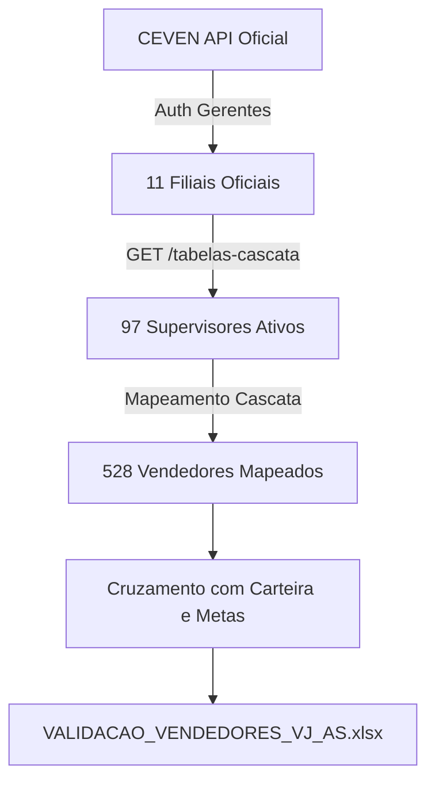

# 📘 Manual de Auditoria e Regras de Negócio — Validação de Força de Vendas (VJ vs AS)

> **Documento Oficial de Engenharia de Dados & Auditoria Operacional**  
> **Sistema:** CEVEN NOC / Grupo Triunfante  
> **Objetivo:** Documentar detalhadamente as regras de cálculo, cruzamento de dados, critérios de detecção de anomalias (outliers) e a lógica de comparação histórica utilizada no gabarito `VALIDACAO_VENDEDORES_VJ_AS.xlsx`.

---

## 📑 Sumário Executivo
1. [Objetivo da Auditoria](#1-objetivo-da-auditoria)
2. [Arquitetura de Coleta dos Dados (Árvore Viva)](#2-arquitetura-de-coleta-dos-dados-árvore-viva)
3. [Chave Primária e Deduplicação](#3-chave-primária-e-deduplicação)
4. [Normalização de Nomes e Regra Anti-Ruído (CLT / PJ)](#4-normalização-de-nomes-e-regra-anti-ruído-clt--pj)
5. [Lógica do Comparativo Histórico (Coluna P)](#5-lógica-do-comparativo-histórico-coluna-p)
6. [Critérios dos Diagnósticos e Sinalizações Operacionais (Coluna O)](#6-critérios-dos-diagnósticos-e-sinalizações-operacionais-coluna-o)
7. [Tratamento dos Vendedores Removidos da Cascata (Linhas Finais)](#7-tratamento-dos-vendedores-removidos-da-cascata-linhas-finais)
8. [Estrutura de Arquivos e Rastreabilidade Histórica](#8-estrutura-de-arquivos-e-rastreabilidade-histórica)

---

## 1. Objetivo da Auditoria
A planilha de validação é o **gabarito mestre de força de vendas** do Grupo Triunfante. Ela consolida os vendedores de todas as 11 filiais e separa com precisão matemática:
* **Canal Varejo (VJ):** Venda diária, rotas roteirizadas, visitas sistemáticas aos PDVs e positivação contínua.
* **Canal Autosserviço (AS) / Atacado:** Contas de grande porte, atendimento negociado, metas volumosas e carteira enxuta.

O objetivo do arquivo é **garantir que nenhum vendedor esteja fantasma, com meta sem carteira, ou com carteira abandonada**, assegurando que os relatórios oficiais de WhatsApp (07:00, 11:00, 11:30, 14:30, 17:00 e 18:30) utilizem números auditados e transparentes.

---

## 2. Arquitetura de Coleta dos Dados (Árvore Viva)
A árvore hierárquica **não é preenchida manualmente**. Ela é extraída diretamente dos servidores de produção do CEVEN através de autenticação tokenizada com as credenciais administrativas e gerenciais:

1. **Autenticação Gerencial Individual:**
   O motor conecta em cada uma das 11 filiais via endpoint oficial:
   `POST https://ceven.drivetriunfante-locomotiva.com.br/api/gerente-auth/login`
2. **Varredura de Supervisores:**
   `GET /api/gerente/supervisores?filial={filialKey}`  
   Retorna todos os supervisores ativos cadastrados na filial.
3. **Extração das Tabelas em Cascata:**
   `GET /api/gerente/tabelas-cascata?filial={filialKey}`  
   Cruza as tabelas de **Produtividade**, **Faturamento** e **Positivação**, extraindo cada vendedor com seu respectivo `id` (RCA), `nome`, `meta de faturamento` e `meta de clientes`.



---

## 3. Chave Primária e Deduplicação
No ambiente corporativo, é comum que vendedores de filiais diferentes tenham códigos numéricos parecidos ou repetidos (ex: RCA `3` existe em TPH e também em outra filial).

* **Regra de Unicidade:** A chave primária de qualquer vendedor no sistema de auditoria é **estritamente composta**:
  $$\text{Chave} = \text{Filial} + \text{"\_"} + \text{Código RCA}$$
  *Exemplos:* `TPH_1037`, `ABC_222`, `TBE_1121`, `MCD_1123`.
* Essa regra garante que nenhum dado seja sobreposto ou atribuído à filial incorreta durante o processamento.

---

## 4. Normalização de Nomes e Regra Anti-Ruído (CLT / PJ)
### O Problema do Ruído Cosmético:
Em cadastros de ERP e portais de vendas, nomes de pessoas sofrem frequentemente ajustes puramente administrativos, como a inclusão ou remoção de prefixos de contrato (`CLT`, `PJ`, `CLT - `, `PJ - `). Se o sistema comparasse strings brutas, o vendedor `Ailton Luiz` seria marcado como "Supervisor Alterado" apenas porque o texto mudou de `CLT AILTON LUIZ ARENDT JUNIOR` para `AILTON LUIZ ARENDT JUNIOR`.

### A Solução Algorítmica (Anti-Ruído):
Antes de qualquer comparação de supervisores ou nomes de vendedores, o algoritmo executa a função de higienização de string:
```python
def clean_name(name):
    if not name:
        return ""
    # 1. Remove os prefixos contratuais no início do texto (case-insensitive)
    n = re.sub(r'^(CLT|PJ)\s*[-–—]?\s*', '', str(name).strip(), flags=re.IGNORECASE)
    # 2. Converte múltiplos espaços internos em espaço único
    n = re.sub(r'\s+', ' ', n)
    # 3. Retorna em CAIXA ALTA e sem espaços nas pontas
    return n.strip().upper()
```
* **Resultado:** Se a única diferença for a sigla `CLT` ou `PJ`, o algoritmo reconhece que o supervisor é **exatamente a mesma pessoa** e marca o registro como `✅ Sem alterações (idêntico ao backup)`.

---

## 5. Lógica do Comparativo Histórico (Coluna P)
A **Coluna P** (`Comparativo vs Backup Anterior`) analisa cada vendedor ativo contra o snapshot do backup anterior (congelado em **11/09/2026**).

Os campos auditados simultaneamente são:
1. **Nome do Supervisor** (Higienizado via regra anti-ruído)
2. **Meta de Faturamento (R$)**
3. **Meta de Positivação (Clientes)**
4. **Canal** (`VJ` vs `AS`)
5. **Carteira de Clientes Distintos**

### Classificações Possíveis na Coluna P:

| Sinalização | Cor no Excel | Critério de Disparo |
| :--- | :---: | :--- |
| **`✅ Sem alterações (idêntico ao backup)`** | Verde Claro (`#E2EFDA`) | Os 5 campos auditados são 100% idênticos ao snapshot anterior. |
| **`📝 ALTERADO: [Detalhes das mudanças]`** | Amarelo Claro (`#FFF2CC`) | O vendedor já existia, mas houve alteração substantiva em um ou mais campos. O texto da célula descreve o *De ➔ Para* exato: <br>• `Meta Fat: R$ X ➔ R$ Y`<br>• `Meta Pos: X ➔ Y`<br>• `Sup: 'Antigo' ➔ 'Novo'`<br>• `Canal: 'VJ' ➔ 'AS'` |
| **`🆕 NOVO: Cadastrado hoje na árvore CEVEN`** | Azul Claro (`#DDEBF7`) | A chave `[Filial]_[RCA]` existe na árvore viva de hoje, mas **não constava no snapshot anterior** (novas contratações/cadastros). |
| **`❌ REMOVIDO DA CASCATA CEVEN`** | Vermelho Claro (`#FCE4D6`) | O RCA constava no snapshot anterior, mas **não foi retornado pela API do CEVEN hoje** (vendedores desligados, setores fundidos ou supervisões extintas). |

---

## 6. Critérios dos Diagnósticos e Sinalizações Operacionais (Coluna O)
A **Coluna O** (`Sinalização / Auditoria CEVEN`) faz o diagnóstico estático de conformidade da operação atual. Suas regras operacionais são:

### A) Operação Regular
* **Condição:** `Meta Faturamento > 0` **E** `Meta Positivação > 0` **E** `Carteira de Clientes > 0`.
* **Resultado:** `✅ Regular (Meta R$ X | Y cli | Z clientes na carteira)` (Fundo Verde).

### B) Outliers Críticos de Cadastro
* **1. Vago / Inativo com Carteira (Alerta Máximo):**
  * *Condição:* Nome do vendedor contém `VAGO` ou `INATIVO` e `Carteira > 0`.
  * *Diagnóstico:* `🚨 OUTLIER: Vago/Inativo com Carteira (X clientes sem vendedor titular)`.
  * *Ação Gerencial:* Clientes correm risco de ficar sem visita; carteira precisa ser redistribuída.
* **2. Com Metas mas Sem Carteira:**
  * *Condição:* `(Meta Fat > 0 OU Meta Pos > 0)` e `Carteira == 0`.
  * *Diagnóstico:* `🚨 OUTLIER: Com Metas mas Sem Carteira`.
  * *Ação Gerencial:* O vendedor foi cobrado por uma meta no sistema, mas não tem clientes roteirizados para positivar.
* **3. Setor Zerado / Ocioso:**
  * *Condição:* `Meta Fat == 0` **E** `Meta Pos == 0` **E** `Carteira == 0`.
  * *Diagnóstico:* `⚠️ OUTLIER: Setor Zerado / Ocioso`.
  * *Ação Gerencial:* Setor inativo ocupando cadastro na filial.
* **4. Com Carteira mas Sem Metas:**
  * *Condição:* `Carteira > 0`, mas `Meta Fat == 0` e `Meta Pos == 0`.
  * *Diagnóstico:* `⚠️ OUTLIER: Com Carteira mas Sem Metas`.
* **5. Sem Meta de Positivação ou Sem Meta de Faturamento:**
  * *Condição:* Possui uma meta preenchida, mas a outra zerada (`Meta Pos == 0` ou `Meta Fat == 0`).
  * *Diagnóstico:* `⚠️ OUTLIER: Sem Meta de Positivação` ou `Sem Meta de Faturamento`.
* **6. Perfil de Autosserviço alocado no Varejo:**
  * *Condição:* Canal cadastrado como `VJ`, porém `Meta Faturamento > R$ 250.000` e `Carteira < 25 clientes`.
  * *Diagnóstico:* `ℹ️ OUTLIER: Perfil AS em Canal VJ`.

### C) Supervisão
* **Supervisão com Venda Direta:**
  * *Condição:* É supervisor/gerente e possui `Meta > 0` ou `Carteira > 0`.
  * *Diagnóstico:* `👔 Supervisão com Venda Direta` (Fundo Azul).
* **Supervisão Administrativa:**
  * *Condição:* É supervisor/gerente sem metas diretas e sem carteira própria.
  * *Diagnóstico:* `👔 Supervisão Administrativa` (Fundo Cinza).

---

## 7. Tratamento dos Vendedores Removidos da Cascata (Linhas Finais)
Quando um vendedor sai do CEVEN, simplesmente apagá-lo da planilha causaria a **perda da rastreabilidade contábil e histórica**. O auditor não saberia se o vendedor foi demitido, se a meta sumiu, ou para onde foram os clientes.

### Solução Adotada:
1. As linhas 3 até 530 mantêm estritamente os **528 vendedores ativos** da árvore viva.
2. Na linha 532, é inserido um divisor visual em vermelho:
   `🚨 VENDEDORES DO BACKUP REMOVIDOS DA CASCATA ATIVA DO CEVEN (40 VENDEDORES)`
3. A partir da linha 534, os **40 vendedores que saíram da cascata** são plotados com todas as suas informações históricas do backup (Filial, Supervisor antigo, Metas e Carteira antigas).
4. Na Coluna P, eles recebem o carimbo em vermelho:
   `❌ REMOVIDO DA CASCATA CEVEN (Presente no backup anterior)`.

---

## 8. Estrutura de Arquivos e Rastreabilidade Histórica

Para que auditorias futuras possam ser feitas sem perda de dados, o repositório mantém uma estrutura de versionamento contínuo:

| Caminho do Arquivo | Função no Sistema |
| :--- | :--- |
| [`VALIDACAO_VENDEDORES_VJ_AS.xlsx`](file:///c:/Users/vitorio.neto/Documents/Projetos%20IA/CEVEN%20v%C3%A1rias%20telas/VALIDACAO_VENDEDORES_VJ_AS.xlsx) | **Arquivo Canônico Ativo:** Planilha oficial lida pelos motores de WhatsApp e relatórios. |
| `auditorias_historico/VALIDACAO_VENDEDORES_VJ_AS_2026-09-11_09h06.xlsx` | **Snapshot Histórico 1:** Fotografia congelada da extração de 11/09/2026. |
| `auditorias_historico/VALIDACAO_VENDEDORES_VJ_AS_2026-09-21_09h56.xlsx` | **Snapshot Histórico 2:** Fotografia congelada da extração de 21/09/2026. |
| `C:\Users\vitorio.neto\Downloads\` | Pasta local espelhada automaticamente para acesso rápido do usuário. |

---

## 9. Painel C-Level: Aba "Resumo Executivo" (Aba 1)

Para que o Diretor, Gerente ou Auditor não precise navegar linha por linha entre centenas de vendedores para extrair conclusões, a planilha agora conta com a aba **`Resumo Executivo`** posicionada como a primeira tela do arquivo.

### Estrutura dos Módulos do Dashboard:

```text
┌───────────────────────────────────────────────────────────────────────────────────┐
│              GRUPO TRIUNFANTE — AUDITORIA EXECUTIVA DE FORÇA DE VENDAS             │
│   Comparativo de Evolução Operacional: 11/09/2026 (Anterior) vs 21/09/2026 (Atual)│
├─────────────┬─────────────┬─────────────┬─────────────┬───────────────────────────┤
│ FORÇA ATIVA │ META FAT R$ │ META POSIT. │  CARTEIRA   │ MÉDIA POR VENDEDOR REGULAR│
│   528 RCAs  │ R$ 76,36 M  │  33.855 cli │  48.111 PDVs│        R$ 144.640         │
├─────────────┴─────────────┴─────────────┴─────────────┴───────────────────────────┤
│ [Quadro 1: Movimentação de Metas]        [Quadro 2: Saúde Cadastral & Riscos]     │
│ • 104 RCAs aumentaram meta (+R$ 5,17M)   • 417 Regulares (R$ 74,93M / 43.839 PDVs)│
│ • 48 RCAs reduziram meta (-R$ 1,97M)     • 🚨 5 Vagos c/ Carteira (597 PDVs risco)│
│ • 368 RCAs mantiveram meta estável       • 🚨 3 c/ Meta sem Carteira (R$ 421k)    │
│ • 8 Novos cadastros na árvore            • ⚠️ 28 c/ Carteira sem Meta (2.788 PDVs)│
│ • 40 RCAs desativados da cascata         • ⚠️ 24 Setores Zerados / Ociosos        │
├───────────────────────────────────────────────────────────────────────────────────┤
│ [Quadro 3: Comparativo das 11 Filiais]                                            │
│ • Tabela com Filial, Gerente, Vendedores (11 ➔ 21), Metas (11 ➔ 21), Variação R$, │
│   Var %, Carteira e Total de Outliers por Unidade.                                │
├───────────────────────────────────────────────────────────────────────────────────┤
│ [Quadro 4: Guia Rápido de Ação para o Gestor / Auditor]                           │
│ • Prioridade 1: Redistribuir os 597 clientes órfãos de setores vagos              │
│ • Prioridade 2: Cadastrar carteira para os 3 RCAs com meta inatingível            │
│ • Prioridade 3: Parametrizar metas nos 2.788 clientes atendidos sem cobrança      │
└───────────────────────────────────────────────────────────────────────────────────┘
```

---

> **Conclusão para o Auditor:**  
> A planilha `VALIDACAO_VENDEDORES_VJ_AS.xlsx` combina o melhor dos dois mundos:
> 1. **Aba `Resumo Executivo`:** Visão estratégica de alto nível para tomada rápida de decisão e identificação de gargalos.
> 2. **Aba `Vendedores VJ vs AS`:** Base de dados granular com 100% de rastreabilidade, auditoria de cada vendedor e a Coluna P com o histórico "De ➔ Para".
